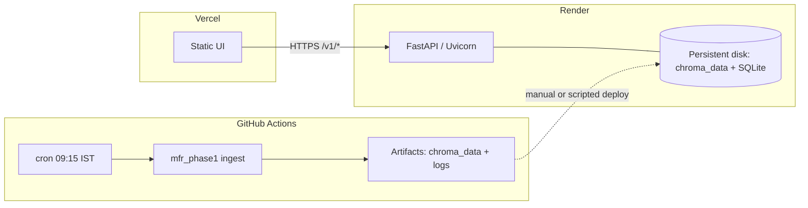

# Deployment plan: GitHub Actions + Render + Vercel

This document describes how to run the Mutual Fund RAG stack in a split layout:

| Layer | Platform | Role |
|--------|----------|------|
| **Ingest scheduler** | GitHub Actions | Daily scrape → chunk → embed → build/update Chroma artifacts |
| **Backend (API)** | Render | FastAPI (`mfr_phase4`): chat, threads, health; optional static fallback |
| **Frontend (UI)** | Vercel | Static hosting for the Phase 4 HTML/JS/CSS |

The application is a **single Python package**; Phase 4 already bundles the REST API and the chat UI. Splitting “frontend” to Vercel means **deploying only the static assets** there and pointing them at the Render API (directly or via Vercel rewrites).

---

## 1. High-level architecture



**Data flow**

1. **Scheduler** runs `python -m mfr_phase1` (see `.github/workflows/ingest-scheduled.yml`). It produces an updated `chroma_data/` tree (and logs). GitHub does not push to Render automatically; you attach artifacts to a release or run a follow-up step that syncs files to Render (see §5).
2. **Render** runs the API with `GROQ_API_KEY`, `CHROMA_PATH`, and a **persistent disk** so Chroma and the thread SQLite DB survive redeploys.
3. **Vercel** serves `index.html`, `styles.css`, and `app.js`. Browsers must reach `/v1/...` on the **same origin** (rewrites) or on the **Render URL** (CORS + small frontend config).

---

## 2. Prerequisites

- GitHub repository with Actions enabled.
- **Render** account; **new Web Service** (Docker optional; native Python is enough).
- **Vercel** account; project linked to the repo or a subtree export.
- **Groq** API key (Phase 2+ answering).
- Optional: custom domains for Render and Vercel.

---

## 3. GitHub Actions scheduler

**Workflow:** `.github/workflows/ingest-scheduled.yml`

- **Schedule:** `45 3 * * *` (UTC) = **09:15 IST** (comment in file explains switching to `15 9 * * *` for 09:15 UTC).
- **Manual run:** `workflow_dispatch` in the Actions tab.
- **What it runs:** `pip install -e .` then `python -m mfr_phase1 --chroma-path chroma_data -v --summary-json ingest_summary.json` with full logging (see workflow for `tee` targets).

**Artifacts**

- `chroma-index` — `chroma_data/` directory after a successful job.
- `ingest-summary` — `ingest_summary.json`.
- `ingest-logs` — `logs/`.

**Operational note:** Treat the Chroma artifact as the **source of truth** after each scheduled run. Deploying fresh vectors to Render is a **separate step** (download artifact + rsync/scp, or a small workflow job that calls Render’s API or SSH—Render typically uses **manual upload** or **re-run ingest on Render** if you colocate the job there). The minimal approach for class projects:

- **Option A (recommended for simplicity):** Run the **same ingest command on Render** (cron job or one-off shell) so Chroma always lives next to the API. Use GitHub Actions as CI proof and backup artifact only.
- **Option B:** Download `chroma-index` from Actions and copy onto Render’s persistent disk (documented runbook in §8).

---

## 4. Backend on Render

### 4.1 Service type

- **Web Service** (not static site).
- **Runtime:** Python 3.11 (match CI).

### 4.2 Build & start commands

Example:

```bash
# Build
pip install --upgrade pip setuptools wheel
pip install -e .

# Start (Render sets PORT)
uvicorn mfr_phase4.app:app --host 0.0.0.0 --port $PORT
```

Set **Root directory** to the repository root (where `pyproject.toml` lives).

### 4.3 Environment variables

| Variable | Purpose |
|----------|---------|
| `GROQ_API_KEY` | Required for chat completions |
| `GROQ_MODEL` | Optional override (default in code) |
| `CHROMA_PATH` | Absolute path on the **persistent disk**, e.g. `/var/data/chroma_data` |
| `CHROMA_COLLECTION` | Optional; default `mutual_fund_faq_groww_v1` |
| `EMBEDDING_MODEL` | Optional; must match ingest |
| `THREAD_DB_PATH` | e.g. `/var/data/threads.sqlite3` (same disk as Chroma) |
| `API_HOST` / `API_PORT` | Ignored by Uvicorn CLI; `PORT` is provided by Render |

**Do not commit** `.env`; set secrets in the Render dashboard.

### 4.4 Persistent disk

Attach a **persistent disk** and mount it (e.g. `/var/data`). Point:

- `CHROMA_PATH=/var/data/chroma_data`
- `THREAD_DB_PATH=/var/data/threads.sqlite3`

Without a disk, **Chroma and threads reset on deploy** and scheduled artifacts on GitHub will not be used by the live service.

### 4.5 First-time Chroma population

After first deploy:

1. **Shell** into the Render service (or one-off job) and run:
   ```bash
   python -m mfr_phase1 --chroma-path "$CHROMA_PATH"
   ```
2. Or copy a prebuilt `chroma_data/` from GitHub Actions artifact onto the disk (Option B above).

### 4.6 Health check

Use Render’s HTTP health check path:

- **Path:** `/health`
- **Expected:** `200` with `{"status":"ok"}`

### 4.7 CORS

The app uses `CORSMiddleware` with `allow_origins=["*"]` and `allow_credentials=False`, so a Vercel origin can call the Render API **directly** if you configure the frontend base URL (§6.2).

---

## 5. Frontend on Vercel

### 5.1 What to deploy

Deploy the static Phase 4 UI:

- `phase4/mfr_phase4/static/index.html` → project root or `public/index.html`
- `phase4/mfr_phase4/static/styles.css` → `public/static/styles.css` (keep paths consistent with HTML)
- `phase4/mfr_phase4/static/app.js` → `public/static/app.js`

**Important:** `index.html` references `/static/styles.css` and `/static/app.js`. Either:

- Keep that URL layout under Vercel `public/static/`, or  
- Edit `index.html` for your chosen paths once.

### 5.2 Calling the Render API (choose one)

**Option A — Vercel rewrites (no frontend code change)**

Add `vercel.json` at the Vercel project root:

```json
{
  "rewrites": [
    {
      "source": "/v1/:path*",
      "destination": "https://YOUR-SERVICE.onrender.com/v1/:path*"
    },
    {
      "source": "/health",
      "destination": "https://YOUR-SERVICE.onrender.com/health"
    }
  ]
}
```

The browser stays on the Vercel origin; `app.js` already uses relative paths like `/v1/chat/respond`, so traffic is proxied to Render.

**Option B — Direct API URL (small HTML/JS change)**

Expose the Render URL to the client, e.g. in `index.html` before loading `app.js`:

```html
<script>window.MFR_API_BASE = "https://YOUR-SERVICE.onrender.com";</script>
```

Then set `API_BASE` in `app.js` from `window.MFR_API_BASE || ""` (implementation task, not required for Option A).

### 5.3 Environment-specific build (optional)

If you inject `MFR_API_BASE` at build time, use a Vercel env var and a tiny build script that rewrites `index.html`; rewrites (Option A) avoid this.

### 5.4 Cache

The API sets `Cache-Control: no-store` on `/v1/*`. Vercel static assets may still be cached; bump `?v=` on CSS/JS when you release UI changes (the template already uses query strings in places).

---

## 6. Scheduler vs production data

| Concern | Recommendation |
|---------|----------------|
| GitHub Actions produces Chroma | Good for CI and backups; **production** should read from Render disk updated by ingest **on Render** or copied from artifact |
| Thread SQLite | Lives only on Render disk; not in GitHub |
| Secrets | `GROQ_API_KEY` only on Render (and local dev); never in Vercel client bundles |

---

## 7. Verification checklist

1. **Render:** `GET https://<service>.onrender.com/health` → `200`.
2. **Render:** `POST /v1/chat/respond` with a test query → factual JSON and `thread_id`.
3. **Vercel:** Open the deployed site; send a message; confirm network calls hit Render (or Vercel rewrite targets).
4. **GitHub Actions:** Run “Scheduled ingest” manually; confirm artifacts and logs.

---

## 8. Runbook: refresh vectors after a scheduled ingest

1. Download `chroma-index` from the successful workflow run.
2. Stop or scale down the Render service if your platform requires a safe copy (or use Render shell).
3. Replace contents of `$CHROMA_PATH` on the persistent disk with the artifact’s `chroma_data/`.
4. Restart the web service and hit `/health` + one chat smoke test.

Alternatively, **SSH/shell on Render** and run `python -m mfr_phase1 --chroma-path "$CHROMA_PATH"` so the live disk is updated in place (no artifact download).

---

## 9. Cost & limits (indicative)

- **Render:** Free tier may spin down; first request after idle can be slow. Persistent disk is a paid add-on on many plans.
- **Vercel:** Hobby tier is sufficient for static UI + rewrites.
- **GitHub Actions:** Within free minutes for a single daily workflow if the repo is public or within quota.

---

## 10. Future improvements

- External **managed vector DB** (e.g. hosted Chroma/Pinecone) so API and ingest share one backend without copying disks.
- **Single origin:** Serve UI from FastAPI (`/`) on Render only and drop Vercel (simplest ops).
- **Terraform / Render Blueprint** (`render.yaml`) to codify the web service and disk.

---

*Document version: 1.0 — aligns with repo layout `phase4/mfr_phase4` and `.github/workflows/ingest-scheduled.yml`.*
